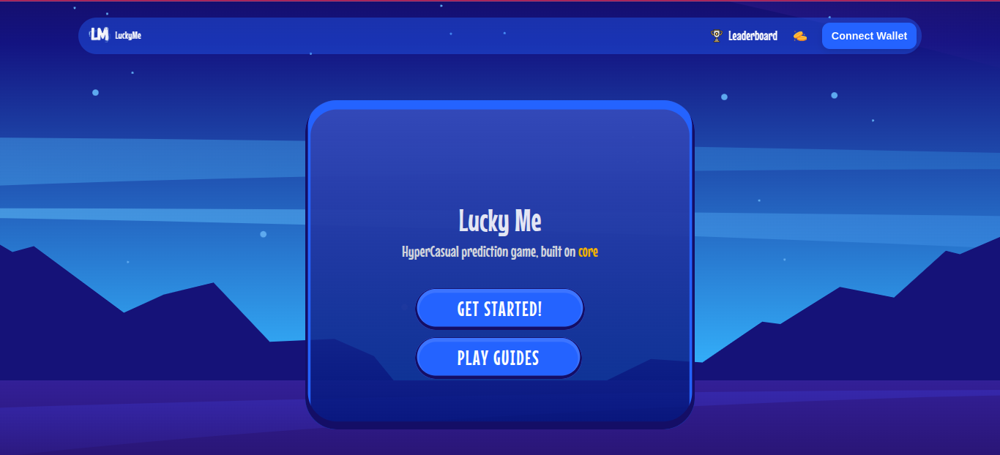

# Lucky Me

## Overview
Lucky Me is a blockchain-based prediction game where players stake CORE, submit answers to randomly generated questions, and earn points for correct predictions. Players are ranked on a leaderboard based on their total points. The game is powered by a **React + TypeScript frontend** integrated with a **Solidity smart contract** deployed on the blockchain.

## Tech Stack
### Frontend
- **React.js** – User interface
- **TypeScript** – Type safety and development efficiency
- **RainbowKit** – Wallet connection and Web3 interactions
- **Ethers.js** – Smart contract interaction
- **Tailwind CSS** – Styling

### Smart Contract
- **Solidity** – Smart contract logic
- **Hardhat** – Smart contract development and testing
- **Core DAO Blockchain** – Deployed network
- **Chainlink VRF (Verifiable Random Function)** – Ensures fair randomness in AI-generated predictions

## Features
- **Wallet Connection**: Users connect via RainbowKit.
- **CORE Staking**: Players stake CORE before playing.
- **AI-Powered Answer Generation**: The game utilizes an AI agent to generate random answers for each prediction question.
- **Blockchain-Based Randomness**: AI-generated answers are verified using on-chain randomness, ensuring fairness and unpredictability.
- **Prediction System**: Players submit answers to game questions.
- **Automated Scoring**: Points awarded based on correct answers.
- **Streak Bonus**: Extra points for consecutive correct answers.
- **Leaderboard**: Top players ranked by total points.
- **Smart Contract Integration**: Data stored securely on-chain.

## How It Works
1. **Stake CORE Tokens**: Players must stake **0.02 CORE** before starting a game.
2. **Receive 10 Questions**: The game presents 10 randomly generated prediction-based questions.
3. **AI Randomly Selects Answers**: A blockchain-based AI agent determines correct answers using **Chainlink VRF** for fairness.
4. **Answer Submission**: Players select either option **A or B** as their prediction.
5. **Leaderboard & Rewards**: Players are ranked by their scores. If a player gets **8 or more correct answers**, they double their stake.

## Live Demo
🔗 **Deployed Game:** [https://luckyme-game1.vercel.app/]

## GitHub Repository
📂 **Frontend & Smart Contract:** [https://github.com/blockfuse-cohort-II/prediction-game]

## Video Demo

🎥 **Watch How It Works:** [https://www.loom.com/share/26927082496542719a6ab7b0c4f8b1ca?sid=02b66ef4-45fd-45d8-a5bd-133d63922a2e]



## Installation & Setup
### Prerequisites
Ensure you have the following installed:
- **Node.js** (LTS version recommended)
- **npm**
- **Hardhat** (for smart contract development)

### Setup & Run Frontend
```sh
# Clone the repository
git clone git@github.com:blockfuse-cohort-II/prediction-game.git
cd prediction-game

# Install dependencies
npm install

# Start the development server
npm run dev
```

### Setup & Deploy Smart Contract
```sh
# Navigate to the smart contract directory
cd smart-contracts

# Install dependencies
npm install

# Compile the smart contracts
npx hardhat compile

# Deploy to Core DAO Testnet (Sepolia or custom network)
npx hardhat run scripts/deploy.js --network coredao

# Verify the contract on the blockchain
npx hardhat ignition verify LuckyMeGame --network coredao
```

## License
This project is licensed under **UNLICENSED**.

